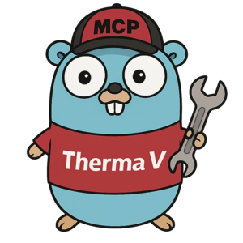
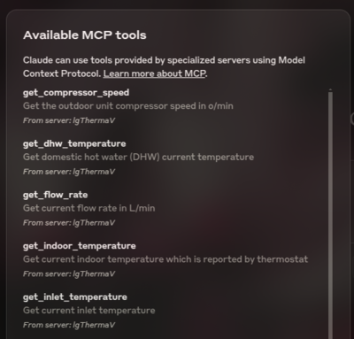

# LG Therma V MCP Server

<h3 align="center"></h3>

The LG Therma V MCP Server is a [Model Context Protocol (MCP)](https://modelcontextprotocol.io/introduction) server that provides seamless integration with Therma V heats pumps via modbus, enabling advanced automation and interaction capabilities for developers and tools.

## ⚠️ Note

This project is in early development and is not yet ready for production use. The API may change, and some features may not be fully implemented.

## Demo

A sample conversation with Claude AI can be viewed [here](https://claude.ai/share/f6945cf1-2fed-47d7-a19b-4d582b7502fa)

## Prerequisites

1. Modbus TCP connection to the LG Therma V heat pump. (such as [Waveshare](https://www.waveshare.com/rs485-to-eth-b.htm))
2. A MCP client, such as [Claude Desktop](https://claude.ai/)

## Installation

1. Grab the binary for your system from the [releases](https://github.com/marinX/lg-thermav-mcp-server/releases) page.
2. Unzip the binary and optionaly place it into your path.
3. Make sure the binary is executable. On Linux and Mac, you can do this by running `chmod +x lg-thermav-mcp-server`.

### Usage with Claude Desktop

1. Copy the file `claude_desktop_config.json` to Claude Desktop config directory.
   - On Mac, this is usually `/Library/Application\ Support/Claude/claude_desktop_config.json`
   - On Linux, this is usually `~/.config/Claude/claude_desktop_config.json`
   - On Windows, this is usually `AppData\Claude\claude_desktop_config.json`
2. Open the `claude_desktop_config.json` file and change `"command":"<path to lg-thermav-mcp-server>"` to the path of the `lg-thermav-mcp-server` binary.
3. Open the `claude_desktop_config.json` file and change `"MODBUS_URL": "<modbus-url>"` to the URL of your modbus TCP connection. For example, `tcp://192.168.1.10:4196`
4. Open Claude Desktop and start a new conversation. You should see available LG Therma V tools if everything is set up correctly.

## License

This project is licensed under the MIT License. See the [LICENSE](LICENSE) file for details.
